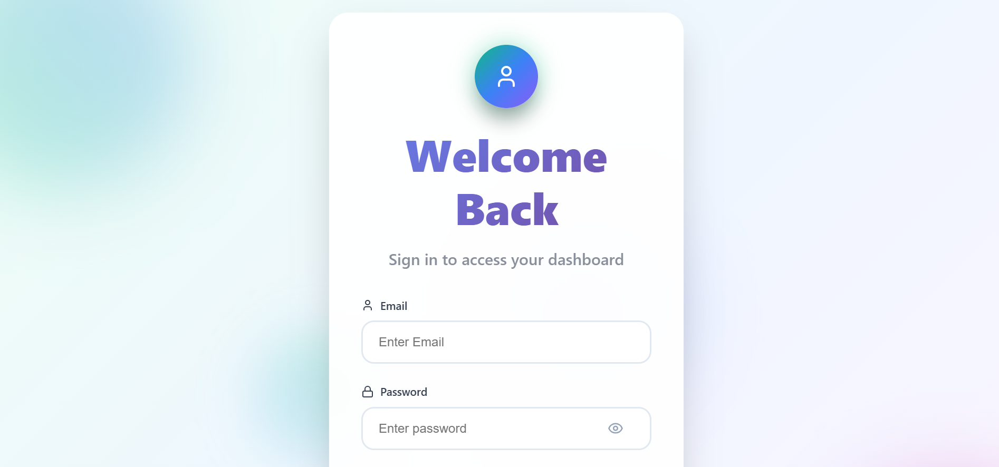
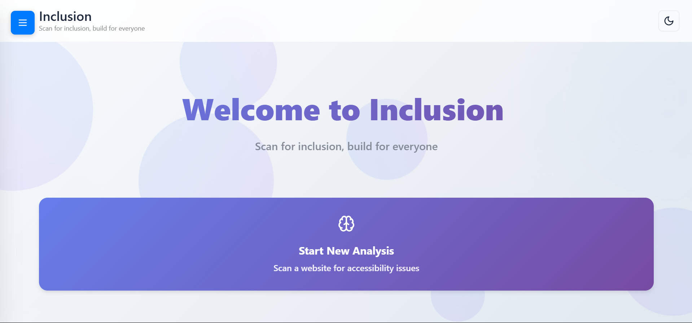
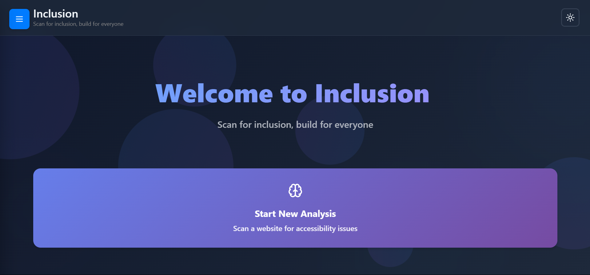
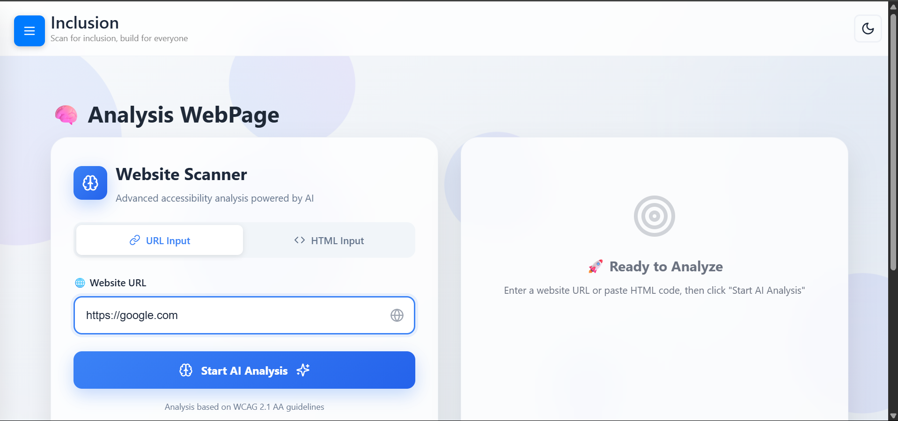
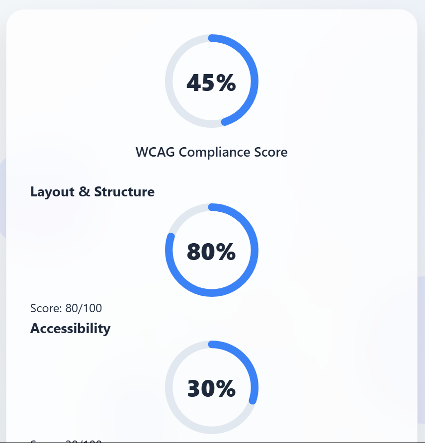

# 🔥 Inclusion Analyzer 🔥

> An automated platform for analyzing the quality of your webpage with a powerful combination of React, Node.js, MongoDB Atlas, FastAPI, and Gemini.
> 
> For better experience clink on link : [Inclusion](https://inclusion-frontend.onrender.com)

---

## 📝 **About The Project**

Webpage Analyzer assesses your website against **10 key components** to help you identify opportunities for improvement:

✅ **Layout & Structure**  
✅ **Accessibility**  
✅ **Visual Design & Aesthetics**  
✅ **Navigation & UX**  
✅ **Performance**  
✅ **SEO Basics**  
✅ **Interactivity & Behavior**  
✅ **Security**  
✅ **Code Quality**  
✅ **Brand Consistency**  

---

## 🚀 **Features**

- 🔍 **Analyze ANY webpage by URL or Source Code**  
- 🌟 **Comprehensive Report with scores for each component**  
- ⚡ **Fast and accurate — powered by Gemini**  
- 🛡 **Safe and reliable — with Node.js + Express + MongoDB + FastAPI**  
- 📈 **Improve your website’s UX, SEO, and Performance**  

---

## 🛠 **Technology Stack**

  
  
  
  
  
  
  
  
  
  
  

---

## 🥇 **Screenshots**

> Here are some snapshots of the application in action:

  
*Login*

 
*Dashboard*

*Report*
 

---

